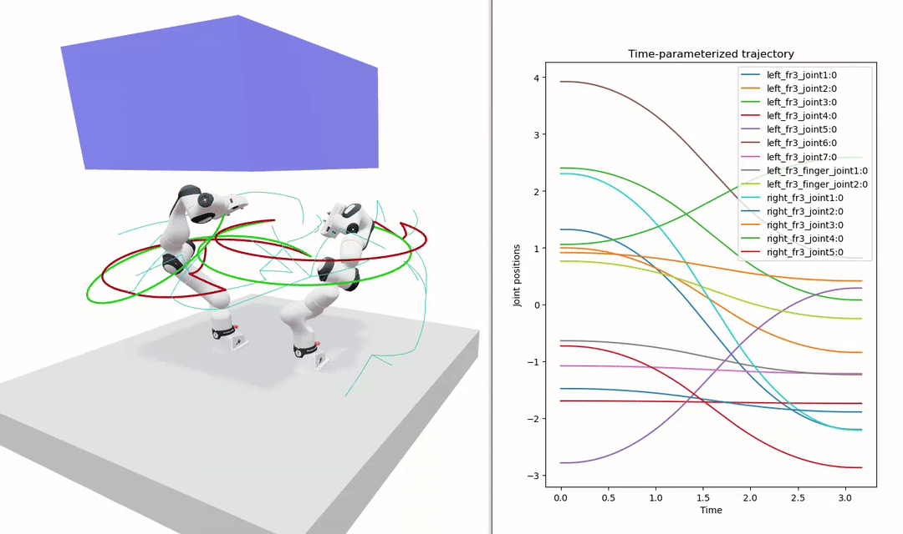

# roboplan

Modern robot motion planning library based on Pinocchio.

Refer to the [full documentation](https://roboplan.readthedocs.io) for more information.

> [!WARNING]
> This is an experimental, work-in-progress repository!

---

## Packages list

The main folders found in this repo are as follows.

- `roboplan` : The core C++ library.
- `roboplan_simple_ik` : A simple inverse kinematics (IK) solver.
- `roboplan_rrt` : A Rapidly-exploring Random Tree (RRT) based motion planner.
- `roboplan_toppra` : A wrapper around the TOPP-RA algorithm for trajectory timing.
- `roboplan_example_models` : Contains robot models used for testing and examples.
- `roboplan_examples` : Basic examples with real robot models.
- `bindings` : Python bindings, with accompanying examples and tests.
- `docs` : The documentation source.

---

